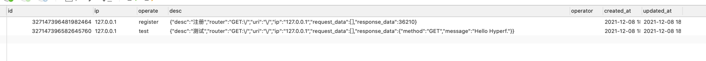

# hyperf 注解日志
> 注意：当前日志的数据存储只支持mysql

使用说明
----------------------------

### 1. 先下载composer包
```composer log
composer require ezijing/hyperf-annotated-log -vvv
```
发布
```shell
 php bin/hyperf.php vendor:publish ezijing/hyperf-annotated-log
```

### 2. 执行数据库脚本
1. 脚本路径
> ./vendor/ezijing/hyperf-annotated-log/db/log.sql

```sql
CREATE TABLE `s_logs` (
  `id` bigint(20) NOT NULL AUTO_INCREMENT COMMENT '主键id',
  `ip` varchar(50) NOT NULL DEFAULT '' COMMENT 'ip地址',
  `operate` varchar(255) NOT NULL DEFAULT '' COMMENT '操作说明',
  `desc` text NOT NULL COMMENT '操作内容',
  `operator` varchar(50) NOT NULL DEFAULT '' COMMENT '操作者',
  `created_at` timestamp NULL DEFAULT NULL,
  `updated_at` timestamp NULL DEFAULT NULL,
  PRIMARY KEY (`id`),
  KEY `idx_ip` (`ip`),
  KEY `idx_operate` (`operate`),
  KEY `idx_operator` (`operator`)
) ENGINE=InnoDB DEFAULT CHARSET=utf8mb4 COMMENT='操作日志表';

```

### 3. 配置操作用户
用户登录成功获取用户信息后进行设置
```php
return [
    // 配置操作者的ID
    // 登录用户信息存储在 Context下
    'user' => [
        'key' => 'user', // context的key
        'id' => 'id', // 用户的id
    ],
];
```

```php
$loginUser = user(); // 获取登录信息伪代码
Context::set('annotation_log.user.key', $loginUser);
```

### 4. 注解操作示例
#### 4.1 注意：
> 1. 目前只支持控制器中的Action进行注解
> 2. 注解到其他方法中也可以；但无法获取到方法传递的动态参数。

#### 4.2示例：
```php
<?php

declare(strict_types=1);

namespace App\Controller;

use App\Services\UserService;
use Ezijing\HyperfAnnotatedLog\Annotations\OperationLog;
use Hyperf\Di\Annotation\Inject;

class IndexController extends AbstractController
{
    /**
     * @Inject
     * @var UserService
     */
    protected $service;

    /**
     * @OperationLog(operation="test", desc="测试")
     */
    public function index()
    {
        $user = $this->request->input('user', 'Hyperf');
        $method = $this->request->getMethod();
        return [
            'method' => $method,
            'message' => "Hello {$user}.",
        ];
    }
}
```

### 4.3 输出结果

